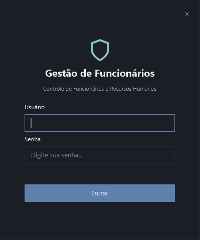
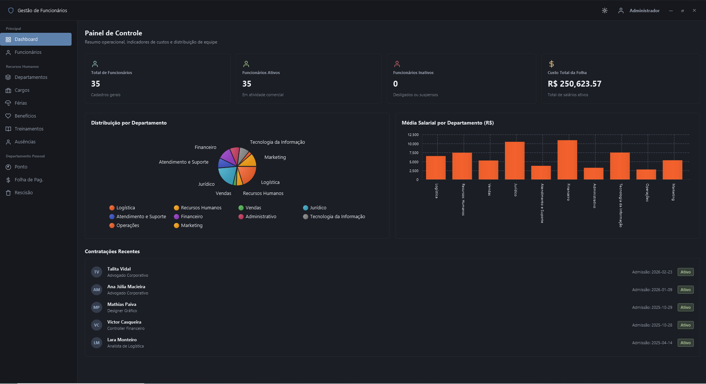

# Gestão de Funcionários

Sistema ERP para RH e Departamento Pessoal com controle de ponto, folha de pagamento, férias, rescisão e relatórios.

---




---

## Funcionalidades Principais

*   **Painel de Controle**: KPIs de pessoal, distribuição por departamento e médias salariais com gráficos.
*   **Gestão de Colaboradores**: Ficha cadastral completa.
*   **Controle de Ponto**: Registro diário de jornada, cálculo de banco de horas.
*   **Folha de Pagamento**: Emissão de holerites com cálculos automáticos de adicionais, INSS, IRRF, FGTS e descontos de faltas.
*   **Férias & Treinamentos**: Agendamentos e controle de férias trabalhistas e histórico de capacitações concluídas.
*   **Simulador de Rescisão**: Cálculo de verbas rescisórias CLT.
*   **UI/UX Moderna**: Tema Nord (AtlantaFX) com suporte a modo dark/light.

---

## Tecnologias Utilizadas

*   **Linguagem**: Java 21 / 25
*   **Interface Gráfica**: JavaFX 21.0.6 (com plugins Maven integrados)
*   **Estilização / UI**: AtlantaFX (Nord Theme) & Custom CSS
*   **Persistência**: JPA / Hibernate ORM 6.4.1.Final
*   **Banco de Dados**: PostgreSQL
*   **Geração de Relatórios**: iText PDF Library 2.1.7
*   **Geração de Massa de Dados (Seed)**: JavaFaker
*   **Gerenciador de Dependências e Build**: Apache Maven

---

## Configuração e Instalação

### Pré-requisitos
1. **Java Development Kit (JDK)** versão 21 ou superior instalado.
2. **PostgreSQL** instalado e rodando localmente na porta padrão `5432`.
3. Banco de dados vazio com o nome `gestao_funcionarios` criado no PostgreSQL:
   ```sql
   CREATE DATABASE gestao_funcionarios;
   ```

### 1. Configurar Conexão
Edite as credenciais do banco de dados no arquivo de propriedades de conexão:
*   [database.properties](file:///f:/projetos/java/gestao-funcionarios/src/main/resources/database.properties)
```properties
db.url=jdbc:postgresql://localhost:5432/gestao_funcionarios
db.username=USER_POSTGRES
db.password=PASSWORD_POSTGRES
```

### 2. Recompilar o Projeto
Abra o terminal na pasta raiz do projeto e execute a limpeza dos arquivos e a compilação completa das classes:
```powershell
# No Windows
.\mvnw clean compile

# No Linux / macOS
./mvnw clean compile
```

### 3. Executar a Aplicação
Execute o comando abaixo para iniciar o servidor interno e abrir a interface gráfica do sistema:
```powershell
# No Windows
.\mvnw javafx:run

# No Linux / macOS
./mvnw javafx:run
```

### Credenciais de Acesso

> A definição do usuário e senha inicial no arquivo de configurações [database.properties](file:///f:/projetos/java/gestao-funcionarios/src/main/resources/database.properties#L5-L7) é obrigatória.
> Caso as chaves `default.admin.username` ou `default.admin.password` estejam ausentes ou com valor em branco, a aplicação não iniciará e lançará uma exceção (`IllegalStateException`).
>
> Por padrão, a configuração inicial vem preenchida com:
> ```properties
> default.admin.username=admin
> default.admin.password=admin
> ```
